# Codyssey 개발 워크스테이션 구축 미션

## 1. 프로젝트 개요

이 저장소는 Codyssey 개발 워크스테이션 구축 미션 결과물이다.

이번 미션에서는 다음 흐름을 직접 수행하고 증거를 남겼다.

1. macOS 터미널에서 파일과 디렉토리 조작
2. 파일/디렉토리 권한 확인 및 변경
3. OrbStack을 이용한 Docker 실행 환경 확인
4. `hello-world`, Ubuntu 컨테이너 실행
5. Dockerfile을 이용한 커스텀 이미지 빌드
6. Python 웹 서버 컨테이너 실행 및 포트 매핑
7. 바인드 마운트를 이용한 호스트 파일 변경 반영
8. Docker 볼륨 영속성, 백업, 복원 검증
9. Git/GitHub를 이용한 버전 관리와 제출 저장소 관리
10. 실제 오류를 재현하고 원인 확인 → 해결하는 트러블슈팅

GitHub Repository: https://github.com/kd0415b/codyssey_kd

> **동료평가 때 한 문장으로 설명:**  
> “터미널로 개발 환경을 다루고, Docker로 같은 환경을 재현하고, GitHub에 실행 과정과 증거를 남기는 미션입니다.”

---

## 2. 실행 환경

| 항목 | 내용 |
| --- | --- |
| OS | macOS |
| Shell | zsh |
| Terminal | macOS Terminal |
| Docker 실행 환경 | OrbStack |
| Docker Version | Docker 28.5.2 |
| Git Version | Git 2.50.1 (Apple Git-155) |

Docker 확인 명령:

```bash
docker --version
docker info
```

확인 결과 핵심:

```text
Docker version 28.5.2, build ecc6942
Context: orbstack
Server Version: 28.5.2
Operating System: OrbStack
OSType: linux
Architecture: x86_64
```

증거:

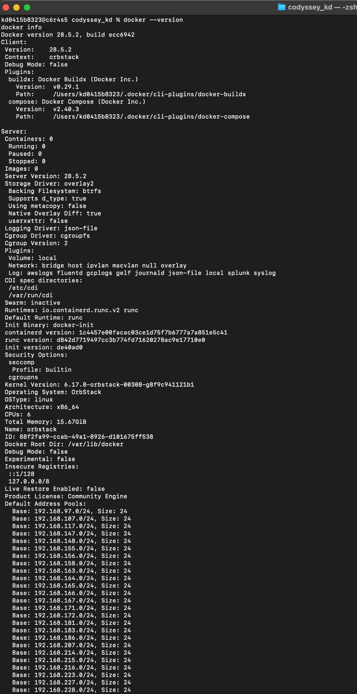

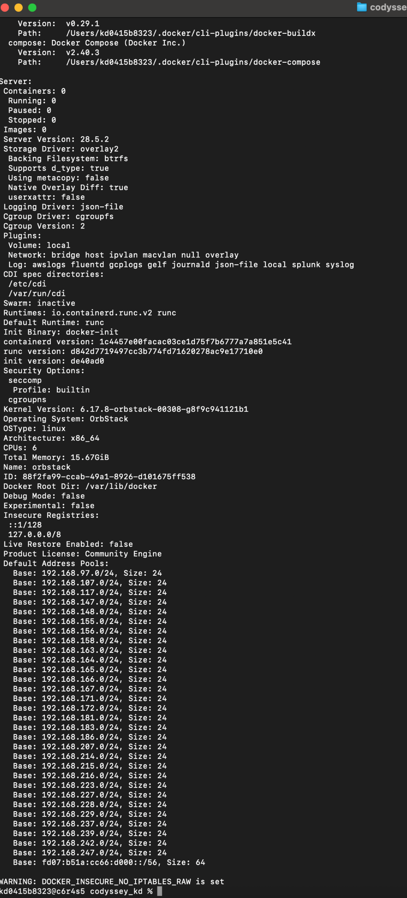

> **설명 포인트:** `docker info`의 Server 정보가 정상 출력되므로 Docker 데몬이 동작 중임을 확인했다.

---

## 3. 수행 체크리스트

- [x] GitHub 저장소 생성 및 clone
- [x] 터미널 기본 조작
- [x] 파일 권한 변경
- [x] 디렉토리 권한 변경
- [x] Docker 설치/데몬 점검
- [x] `hello-world` 실행
- [x] Ubuntu 컨테이너 진입 및 내부 명령
- [x] Dockerfile 기반 커스텀 이미지 빌드
- [x] 웹 서버 컨테이너 실행
- [x] 포트 매핑 및 브라우저 접속
- [x] 바인드 마운트 변경 반영
- [x] Docker 볼륨 영속성 확인
- [x] Docker 볼륨 백업/복원
- [x] `docker images`, `ps`, `logs`, `stats` 운영 명령
- [x] 포트 충돌 진단 및 해결
- [x] `run` / `exec` 동작 차이 관찰
- [x] Git/GitHub 연동
- [x] 트러블슈팅 2건 이상
- [x] 민감정보 미노출 확인

---

## 4. 프로젝트 구조

```text
codyssey_kd/
├── Dockerfile
├── README.md
├── server.py
├── hello.py
├── grep_test.txt
├── docs/
│   └── docker_evidence.txt
├── images/
│   └── evidence/
└── backup/
    └── codyssey-backup.tar.gz   # 볼륨 백업 실습에서 생성
```

구조를 이렇게 나눈 이유:

- `README.md`: 평가자가 전체 수행 내용을 빠르게 확인
- `docs/`: 긴 실제 출력 로그 보관
- `images/evidence/`: 평가 증거 캡처를 항목별로 정리
- `Dockerfile`, `server.py`: 이미지 빌드와 서버 실행에 바로 필요한 파일
- `backup/`: 볼륨 백업 실습 결과 보관

이 구조는 **재현성, 확인 편의성, 보안**을 기준으로 구성했다.

증거:

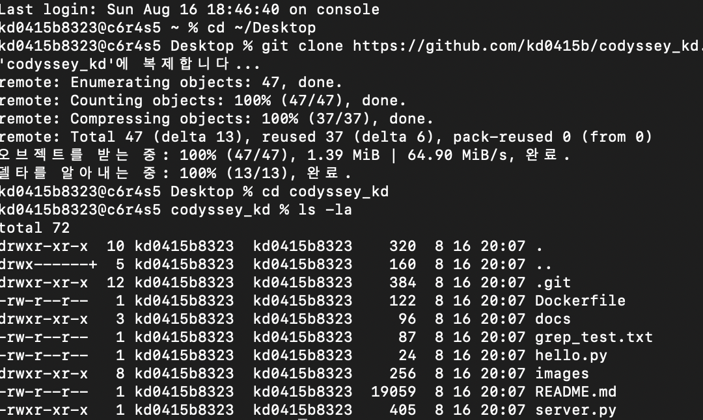

---

## 5. 터미널 기본 조작

주요 명령:

```bash
pwd
ls
ls -la
cd ~/Desktop
git clone https://github.com/kd0415b/codyssey_kd
cd codyssey_kd
mkdir permission_test
touch hello.py
cp hello.py hello_copy.py
mv hello_copy.py hello_backup.py
rm hello_backup.py
cat server.py
```

### 절대 경로와 상대 경로

**절대 경로**는 파일 시스템의 시작점부터 전체 위치를 적는다.

```text
/Users/kd0415b8323/Desktop/codyssey_kd
```

**상대 경로**는 현재 위치를 기준으로 적는다.

```text
./server.py
docs/docker_evidence.txt
```

선택 기준:

- 프로젝트 내부 파일을 가리킬 때 → 상대 경로 우선
- 호스트의 실제 위치를 Docker에 넘길 때 → 절대 경로 필요
- 바인드 마운트에서는 직접 사용자 경로를 쓰는 대신 `$(pwd)`를 사용

```bash
-v "$(pwd):/app"
```

`$(pwd)`는 현재 프로젝트의 절대 경로를 자동으로 가져오기 때문에 다른 위치에서 clone해도 같은 형식으로 실행하기 쉽다.

> **설명 포인트:** 상대 경로는 프로젝트 이동에 유리하고, 절대 경로는 정확한 실제 위치가 필요할 때 사용한다.

---

## 6. 권한 실습

권한 표기:

| 표기 | 의미 |
| --- | --- |
| `r` | read: 읽기 |
| `w` | write: 쓰기 |
| `x` | execute: 실행 |
| `644` | 소유자 읽기/쓰기, 나머지 읽기 |
| `755` | 소유자 읽기/쓰기/실행, 나머지 읽기/실행 |

파일 권한 실습:

```bash
chmod 644 server.py
ls -la server.py
chmod 755 server.py
ls -la server.py
```

실제 출력:

```text
-rw-r--r--  ... server.py
-rwxr-xr-x  ... server.py
```

증거:

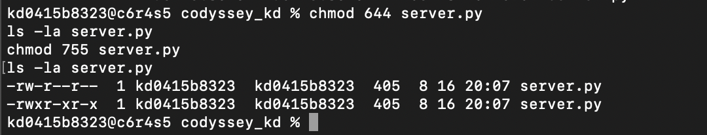

디렉토리 권한 예:

```bash
mkdir permission_test
chmod 700 permission_test
ls -ld permission_test
chmod 755 permission_test
ls -ld permission_test
```

> **설명 포인트:** `755`는 파일에 실행 권한을 주는 경우 자주 쓰고, 디렉토리의 `x`는 그 디렉토리 안으로 들어가거나 내부 항목에 접근하기 위해 필요하다.

---

## 7. Docker 기본 점검과 hello-world

```bash
docker run hello-world
```

실행 결과:

```text
Hello from Docker!
This message shows that your installation appears to be working correctly.
```

증거:

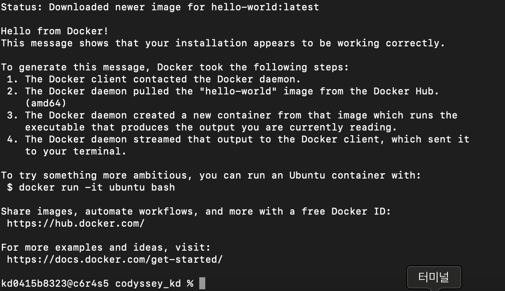

이미지/컨테이너 확인:

```bash
docker images
docker ps -a
```

삭제 확인:

```bash
docker rm affectionate_buck
docker ps -a
```

증거:

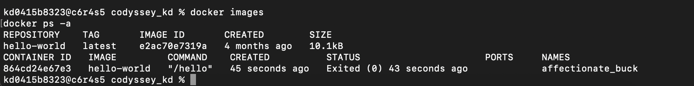

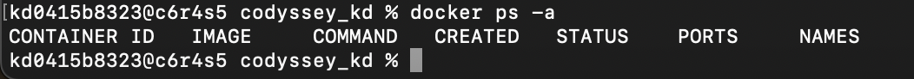

---

## 8. Dockerfile과 커스텀 이미지

Dockerfile:

```dockerfile
FROM python:3.11-slim

WORKDIR /app

COPY . .

RUN pip install --upgrade pip

EXPOSE 8080

CMD ["python", "server.py"]
```

의미:

| 명령 | 의미 |
| --- | --- |
| `FROM python:3.11-slim` | Python 3.11 slim을 베이스 이미지로 사용 |
| `WORKDIR /app` | 컨테이너 작업 디렉토리를 `/app`으로 설정 |
| `COPY . .` | 빌드 시점의 프로젝트 파일을 이미지에 복사 |
| `RUN pip install --upgrade pip` | 이미지 빌드 중 pip 업그레이드 |
| `EXPOSE 8080` | 8080 포트를 사용하는 서버임을 문서화 |
| `CMD ["python", "server.py"]` | 컨테이너 시작 시 서버 실행 |

빌드:

```bash
docker build -t codyssey .
docker images
```

증거:

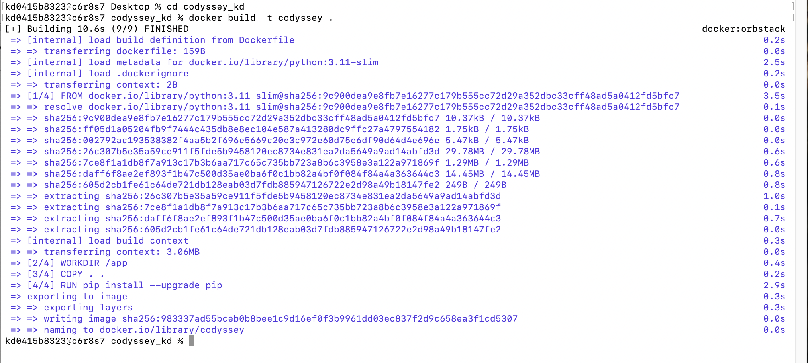

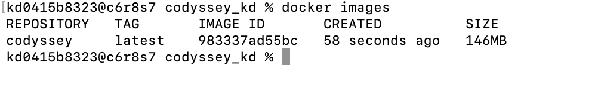

---

## 9. Docker 이미지와 컨테이너의 차이

**이미지(Image)** 는 컨테이너를 만들기 위한 실행 환경의 원본이다.  
Dockerfile을 빌드하면 코드와 실행 환경이 이미지에 포함된다.

**컨테이너(Container)** 는 이미지를 실제로 실행한 인스턴스이다. 하나의 이미지로 여러 개의 컨테이너를 실행할 수 있다.

| 구분 | 이미지 | 컨테이너 |
| --- | --- | --- |
| 역할 | 실행 환경의 원본 | 이미지를 실제로 실행한 상태 |
| 생성 | `docker build` | `docker run` |
| 실행 여부 | 실행되지 않은 템플릿 | 프로세스가 실제 실행 중 |
| 변경 | 같은 태그를 다시 빌드해 새 이미지 생성 | 실행 중 파일/상태 변경 가능 |
| 개수 | 하나의 이미지 재사용 가능 | 같은 이미지로 여러 개 생성 가능 |

이번 실습에서는:

```bash
docker build -t codyssey .
docker run -d -p 8080:8080 --name codyssey-web codyssey
```

로 **이미지를 만든 뒤 그 이미지로 컨테이너를 실행**했다.

> **설명 포인트:** “이미지는 설계도, 컨테이너는 그 설계도로 실제 실행한 결과”라고 설명하면 된다.

---

## 10. Python 웹 서버와 포트 매핑

`server.py` 핵심:

```python
from http.server import HTTPServer, BaseHTTPRequestHandler

class Handler(BaseHTTPRequestHandler):
    def do_GET(self):
        self.send_response(200)
        self.send_header('Content-type', 'text/html')
        self.end_headers()
        self.wfile.write(b'<h1>Hello, Codyssey!</h1>')

httpd = HTTPServer(('0.0.0.0', 8080), Handler)
print('서버 시작: http://localhost:8080')
httpd.serve_forever()
```

컨테이너 실행:

```bash
docker run -d -p 8080:8080 --name codyssey-web codyssey
docker ps
```

증거:

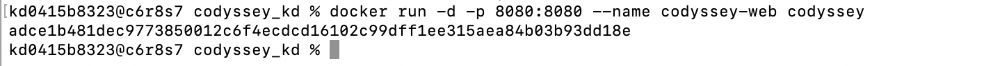

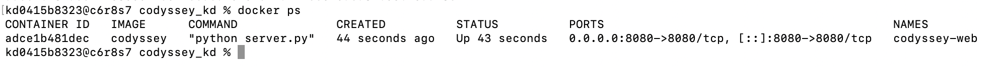

브라우저:

```text
http://localhost:8080
```

증거:


### 왜 포트 매핑이 필요한가

Docker 컨테이너는 호스트와 분리된 네트워크 환경을 가진다. 컨테이너 내부 서버가 8080을 사용해도, 호스트 Mac의 브라우저가 자동으로 그 포트에 연결되는 것은 아니다.

```text
Mac localhost:8080
        ↓
  Docker port mapping
        ↓
Container :8080
```

`-p 8080:8080`에서:

- 앞 `8080` = 호스트 Mac 포트
- 뒤 `8080` = 컨테이너 포트

### 네트워크 네임스페이스와 보안

컨테이너는 네트워크 네임스페이스를 통해 호스트와 분리된 네트워크 공간에서 실행된다. 포트를 `-p`로 공개하면 호스트를 통해 접근 가능한 통로가 생긴다.

실습에서는:

```text
0.0.0.0:8080->8080/tcp
```

로 확인했다.

필요하지 않은 포트를 공개하면 접근 경로가 늘어나므로 **필요한 포트만 노출**하는 것이 안전하다. 개발 중 외부 접근이 필요 없다면 다음처럼 로컬 주소에만 바인딩하는 방법도 있다.

```bash
docker run -p 127.0.0.1:8080:8080 codyssey
```

> **설명 포인트:** 컨테이너가 격리돼 있기 때문에 포트 매핑이 필요하고, 포트를 공개할 때는 필요한 범위만 열어야 한다.

---

## 11. 포트 충돌 진단과 해결

8080을 사용하는 컨테이너 확인:

```bash
docker ps --filter publish=8080
lsof -i :8080
```

증거:

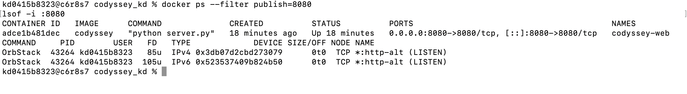

같은 8080 포트로 두 번째 컨테이너를 실행해 충돌을 재현:

```bash
docker run -d -p 8080:8080 --name codyssey-conflict codyssey
```

오류:

```text
Bind for 0.0.0.0:8080 failed: port is already allocated
```

증거:

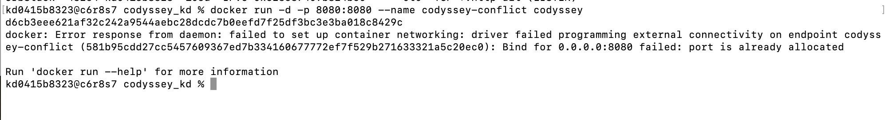

해결:

```bash
docker rm codyssey-conflict
docker run -d -p 8081:8080 --name codyssey-conflict codyssey
docker ps
```

8080을 사용 중인 기존 서비스는 유지하고, 두 번째 컨테이너의 **호스트 포트만 8081로 변경**했다.

증거:

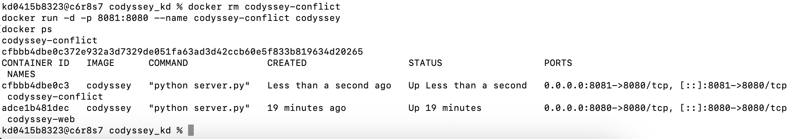

진단 순서:

```text
포트 사용 여부 확인
→ 어떤 프로세스/컨테이너가 사용하는지 확인
→ 기존 서비스를 종료할지 판단
→ 종료할 수 없으면 다른 호스트 포트로 재할당
```

---

## 12. 바인드 마운트

바인드 마운트 컨테이너:

```bash
docker run -d -p 8082:8080 -v "$(pwd):/app" --name codyssey-bind codyssey
```

`-v "$(pwd):/app"`은:

```text
호스트 codyssey_kd 폴더
        ↕
컨테이너 /app
```

을 직접 연결한다.

증거:

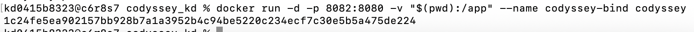

변경 전:

```bash
curl http://localhost:8082
```

```html
<h1>Hello, Codyssey!</h1>
```

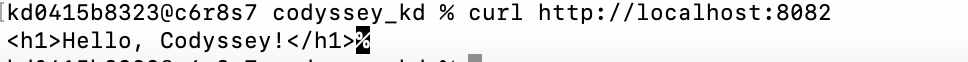

호스트 `server.py` 변경:

```bash
sed -i '' 's/Hello, Codyssey!/Bind Mount Changed!/' server.py
grep "Bind Mount" server.py
```

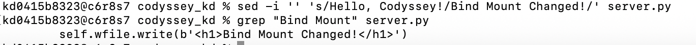

이미지를 다시 `docker build`하지 않고 컨테이너만 재시작:

```bash
docker restart codyssey-bind
sleep 2 && curl http://localhost:8082
```

결과:

```html
<h1>Bind Mount Changed!</h1>
```

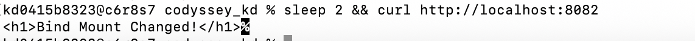

실습 후 `server.py`는 원래 문구로 복원했고 `git status`로 확인했다.

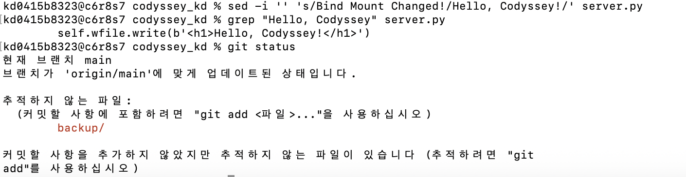

> **설명 포인트:** 이미지에 복사된 파일을 바꾼 것이 아니라, 호스트 폴더를 컨테이너에 직접 연결했기 때문에 호스트 변경 내용이 컨테이너에 반영됐다.

---

## 13. Docker 볼륨과 데이터 영속성

볼륨은 컨테이너와 분리된 Docker 관리 저장공간이다.

볼륨 생성:

```bash
docker volume create codyssey-backup-vol
docker volume ls
```

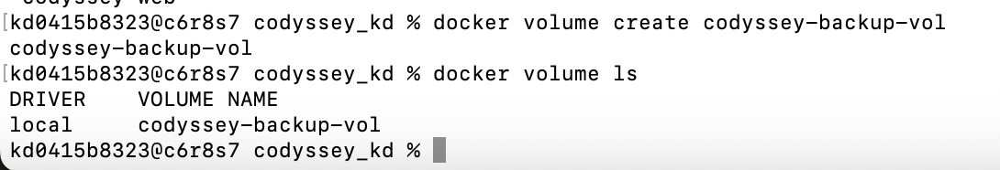

볼륨에 파일 작성:

```bash
docker run -d --name volume-test \
  -v codyssey-backup-vol:/data ubuntu sleep infinity

docker exec volume-test sh -c \
  'echo "Codyssey persistent data" > /data/hello.txt && cat /data/hello.txt'
```

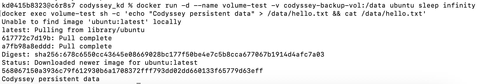

첫 컨테이너 삭제 → 새 컨테이너에 같은 볼륨 연결:

```bash
docker rm -f volume-test

docker run -d --name volume-test2 \
  -v codyssey-backup-vol:/data ubuntu sleep infinity

docker exec volume-test2 cat /data/hello.txt
```

결과:

```text
Codyssey persistent data
```

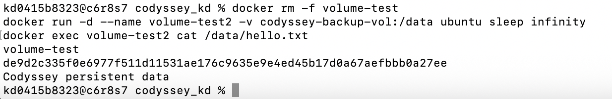

> **설명 포인트:** 컨테이너를 삭제했는데도 같은 볼륨을 연결한 새 컨테이너에서 파일이 읽혔기 때문에 데이터 영속성이 확인됐다.

---

## 14. Docker 볼륨 백업과 복원

볼륨은 컨테이너 삭제에는 강하지만 **볼륨 자체가 삭제되면 데이터도 없어질 수 있기 때문에 중요한 데이터는 별도 백업이 필요**하다.

백업 폴더 생성 및 `tar.gz` 백업:

```bash
mkdir -p backup

docker run --rm \
  -v codyssey-backup-vol:/data \
  -v "$(pwd)/backup:/backup" \
  ubuntu \
  tar czf /backup/codyssey-backup.tar.gz -C /data .

ls -lh backup
```

증거:

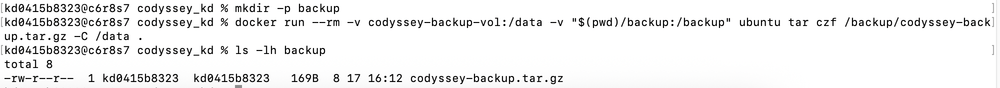

새 볼륨 생성 후 복원:

```bash
docker volume create codyssey-restore-vol

docker run --rm \
  -v codyssey-restore-vol:/data \
  -v "$(pwd)/backup:/backup" \
  ubuntu \
  tar xzf /backup/codyssey-backup.tar.gz -C /data

docker run --rm \
  -v codyssey-restore-vol:/data \
  ubuntu \
  cat /data/hello.txt
```

결과:

```text
Codyssey persistent data
```

증거:

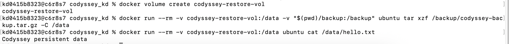

즉:

```text
원본 볼륨
→ tar.gz 백업
→ 새로운 빈 볼륨
→ 백업 복원
→ 원래 데이터 확인
```

까지 실제로 검증했다.

---

## 15. Docker 운영 명령

```bash
docker images
docker ps
docker ps -a
docker logs codyssey-web
docker stats --no-stream
```

로그:

```text
"GET / HTTP/1.1" 200
"GET /favicon.ico HTTP/1.1" 200
```

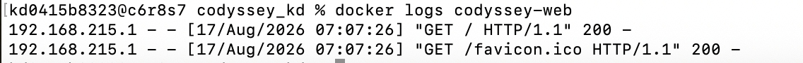

리소스 사용량:

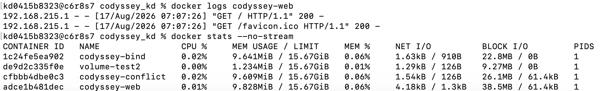

| 명령 | 목적 |
| --- | --- |
| `docker images` | 이미지 목록 |
| `docker ps` | 실행 중 컨테이너 |
| `docker ps -a` | 종료된 컨테이너 포함 전체 목록 |
| `docker logs` | 컨테이너 표준 출력/오류 로그 |
| `docker stats --no-stream` | CPU, 메모리, 네트워크 사용량 1회 확인 |

---

## 16. Ubuntu 컨테이너와 run / exec 차이

Ubuntu 실행:

```bash
docker run -it --name ubuntu-practice ubuntu bash
```

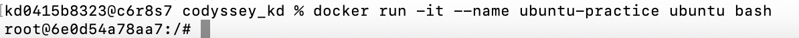

컨테이너 내부:

```bash
pwd
ls
echo "Hello from Ubuntu container"
cat /etc/os-release
```

확인:

```text
/
Hello from Ubuntu container
PRETTY_NAME="Ubuntu 26.04 LTS"
```

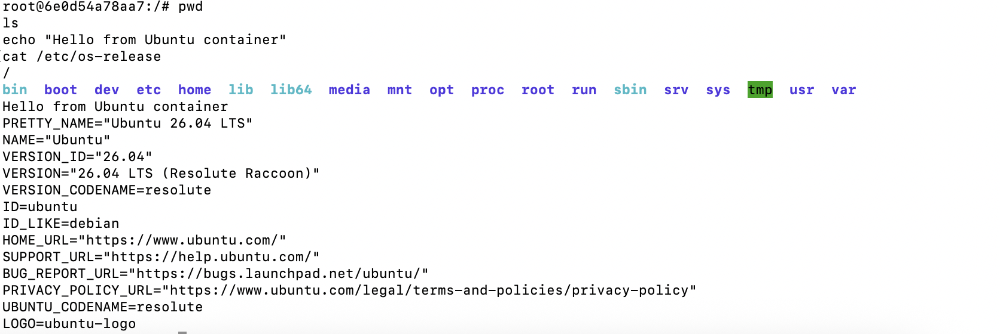

### 처음 실행한 bash 종료

```bash
exit
docker ps -a --filter name=ubuntu-practice
```

결과:

```text
Exited (0)
```

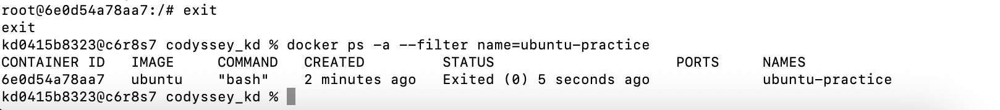

처음 `docker run -it ... bash`로 실행했을 때 `bash`가 컨테이너의 주 프로세스였기 때문에 `exit`로 bash가 끝나면 컨테이너도 종료됐다.

### exec로 추가 bash 실행

```bash
docker start ubuntu-practice
docker exec -it ubuntu-practice bash
exit
docker ps --filter name=ubuntu-practice
```

결과:

```text
STATUS: Up
```

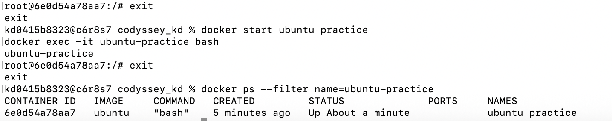

`docker exec`는 이미 실행 중인 컨테이너에 **추가 프로세스**를 실행하는 방식이다. 따라서 exec로 연 bash에서 `exit`해도 컨테이너의 기존 주 프로세스는 계속 실행된다.

`docker attach`는 실행 중인 컨테이너의 **기존 기본 입출력(STDIN/STDOUT/STDERR)에 직접 연결**하는 방식이다. 반면 `exec`는 별도의 명령이나 셸을 새로 실행한다.

> **설명 포인트:** “attach는 원래 실행 흐름에 붙고, exec는 실행 중인 컨테이너 안에 새 명령을 추가한다.”

---

## 17. Git 설정 및 GitHub 연동

```bash
git config --global user.name "사용자 이름"
git config --global user.email "사용자 이메일"
git config --global init.defaultBranch main
git config --list
```

원격 저장소:

```text
remote.origin.url=https://github.com/kd0415b/codyssey_kd
```

업로드 과정:

```bash
git status
git add .
git commit -m "Add Docker verification evidence and README improvements"
git push origin main
```

GitHub 토큰, 비밀번호, 인증 코드, 개인키는 README나 이미지에 기록하지 않는다.

> 최종 push 성공 화면은 이 README와 증거 이미지를 저장소에 반영한 뒤 추가한다.

---

## 18. 트러블슈팅

### 18-1. 이미지 빌드 후 생성한 파일이 컨테이너에 없었던 문제

문제:

```bash
docker run codyssey python hello.py
```

오류:

```text
python: can't open file '/app/hello.py': [Errno 2] No such file or directory
```

원인:

`hello.py`를 이미지 빌드 이후 생성했다. Dockerfile의 `COPY . .`는 **빌드 시점**의 파일을 이미지 안에 복사한다.

해결:

```bash
docker build -t codyssey .
docker run codyssey python hello.py
```

결과:

```text
hello, DOOCHAN
```

### 18-2. 파일명 오타

문제:

```bash
ls -l sever.py
```

오류:

```text
ls: sever.py: No such file or directory
```

확인:

```bash
ls
```

실제 파일명은 `server.py`였다.

해결:

```bash
ls -l server.py
```

### 18-3. 8080 포트 충돌

문제:

```text
Bind for 0.0.0.0:8080 failed: port is already allocated
```

확인:

```bash
docker ps --filter publish=8080
lsof -i :8080
```

해결:

```bash
docker run -d -p 8081:8080 --name codyssey-conflict codyssey
```

기존 8080 서비스를 종료하지 않고 호스트 포트를 8081로 변경했다.

### 18-4. 컨테이너 재시작 직후 curl 실패

문제:

```text
curl: (52) Empty reply from server
```

원인 가설:

`docker restart` 직후 서버 프로세스가 요청을 받을 준비가 되기 전에 `curl`을 실행했다.

확인/해결:

```bash
sleep 2 && curl http://localhost:8082
```

결과:

```html
<h1>Bind Mount Changed!</h1>
```

즉 잠시 대기한 뒤 재시도하자 정상 응답을 확인했다.

---

## 19. 보안 및 개인정보 보호

| 항목 | 처리 |
| --- | --- |
| GitHub Token | README/이미지에 기록하지 않음 |
| 비밀번호 | 기록하지 않음 |
| 인증 코드 | 기록하지 않음 |
| SSH 개인키 | 기록하지 않음 |
| Git 이메일 | 필요 시 마스킹 |
| 공개 포트 | 필요한 포트만 사용 |
| 공유 로그 | 민감정보 포함 여부 확인 후 업로드 |

특히 GitHub 개인 액세스 토큰은 공개 저장소에 절대 커밋하지 않는다.

---

## 20. 다른 환경에서 재현할 때

이번 실습은 **macOS + zsh + OrbStack** 기준이다.

macOS/Linux:

```bash
-v "$(pwd):/app"
```

Windows에서는 셸과 Docker 실행 환경에 따라 현재 경로 표현이 달라질 수 있으므로 해당 환경의 경로 문법으로 변경해야 한다.

재현 순서:

```bash
git clone https://github.com/kd0415b/codyssey_kd
cd codyssey_kd
docker build -t codyssey .
docker run -d -p 8080:8080 --name codyssey-web codyssey
curl http://localhost:8080
```

---

## 21. 동료평가용 핵심 요약

### Docker 이미지와 컨테이너
- 이미지 = 실행 환경 원본/설계도
- 컨테이너 = 이미지를 실제 실행한 인스턴스

### 포트 매핑
- 컨테이너는 호스트와 네트워크가 분리됨
- `-p 8080:8080`으로 호스트와 컨테이너 포트를 연결

### 바인드 마운트
- 호스트 폴더를 컨테이너 폴더에 직접 연결
- 호스트 파일 변경을 재빌드 없이 반영 가능

### 볼륨
- 컨테이너와 분리된 Docker 관리 저장공간
- 컨테이너 삭제 후에도 데이터 유지
- 중요한 데이터는 별도 백업 필요

### 절대/상대 경로
- 상대 경로: 프로젝트 내부 파일에 유리
- 절대 경로: 호스트의 실제 위치가 필요할 때 사용
- `$(pwd)`로 현재 절대 경로를 자동 사용

### Git과 GitHub
- Git = 로컬 변경 이력 관리
- GitHub = 원격 저장소 및 협업/제출 플랫폼

---

## 22. 실제 검증 로그

Docker 실제 출력은 다음 파일에도 정리한다.

- [Docker 실제 검증 로그](docs/docker_evidence.txt)

README의 각 섹션에는 이번 실습에서 직접 확보한 캡처를 연결해 두었다.
