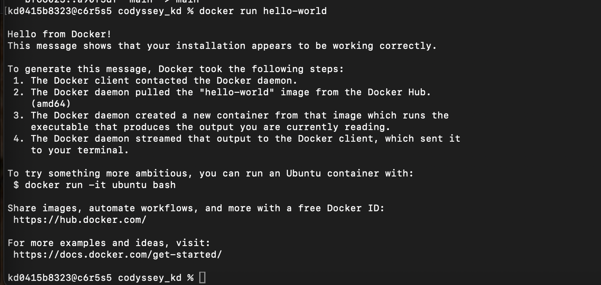
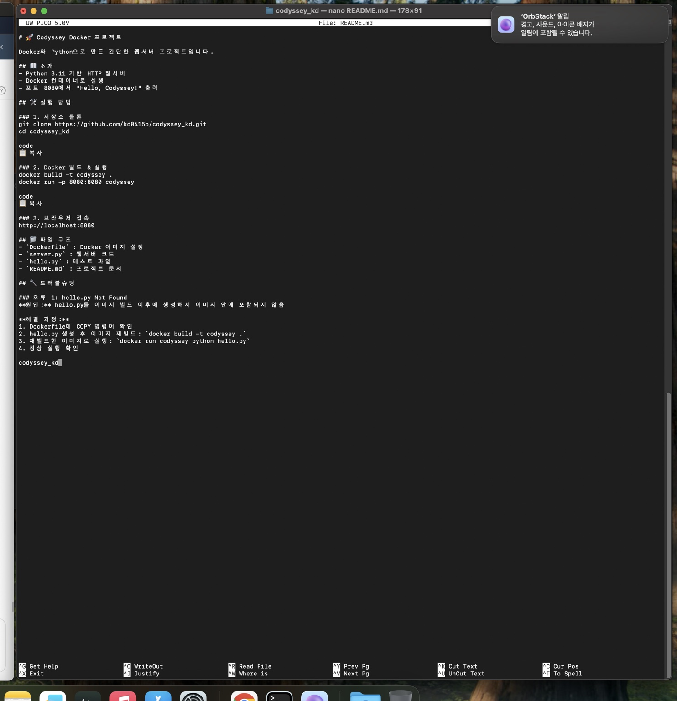
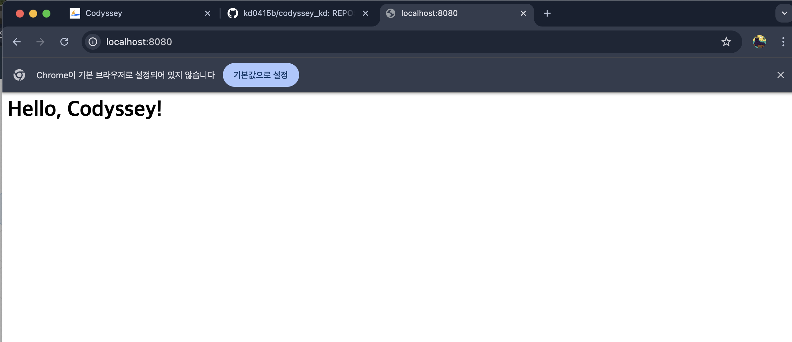
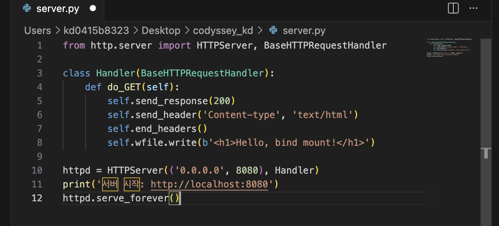
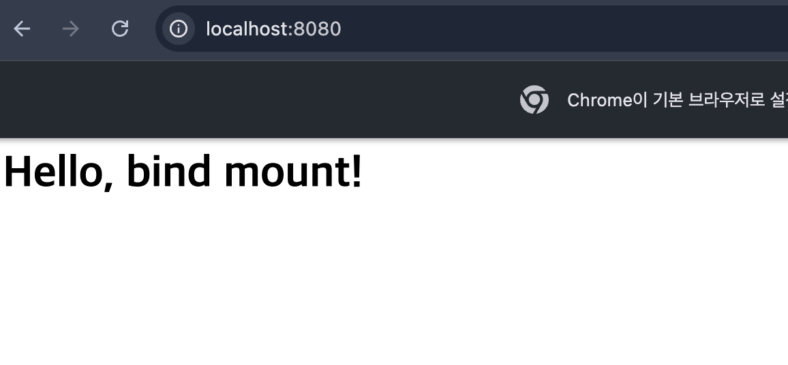
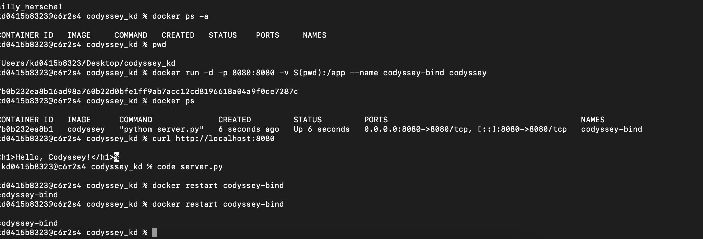

# Codyssey 개발 워크스테이션 구축 미션

## 1. 프로젝트 개요

이 저장소는 Codyssey 개발 워크스테이션 구축 미션 결과물이다. 터미널, Docker, Git/GitHub를 사용하여 개발 환경을 구성하고, Python 웹 서버를 Docker 컨테이너로 실행한 뒤 포트 매핑과 바인드 마운트 동작을 확인했다.

GitHub Repository: https://github.com/kd0415b/codyssey_kd

## 2. 실행 환경

| 항목 | 내용 |
| --- | --- |
| OS | macOS |
| Shell | zsh |
| Terminal | macOS Terminal |
| Docker 실행 환경 | OrbStack |
| Docker Version | Docker version 28.5.2, build ecc6942 |
| Git Version | git version 2.50.1 (Apple Git-155) |

Docker 버전 확인:

```bash
docker --version
```

실행 결과:

```text
Docker version 28.5.2, build ecc6942
```

Docker 데몬 정보 확인:

```bash
docker info
```

Git 버전 확인:

```bash
git --version
```

실행 결과:

```text
git version 2.50.1 (Apple Git-155)
```

주요 확인 결과:

```text
Client:
 Version:    28.5.2
 Context:    orbstack

Server:
 Containers: 0
 Images: 0
 Server Version: 28.5.2
 Storage Driver: overlay2
 Operating System: OrbStack
 OSType: linux
 Architecture: x86_64
 CPUs: 6
 Total Memory: 15.67GiB
 Name: orbstack
```

## 3. 수행 체크리스트

| 항목 | 기록 내용 |
| --- | --- |
| GitHub 저장소 생성 | 완료 |
| 저장소 clone | 완료 |
| Dockerfile 작성 | 완료 |
| `server.py` 작성 | 완료 |
| Python 웹 서버 작성 | 완료 |
| Docker 이미지 빌드 | 완료 |
| `docker run hello-world` | 성공 로그 기록 |
| Ubuntu 컨테이너 진입 | 실행 로그 기록 |
| Ubuntu 내부 명령 실행 | `cat /etc/os-release`, `pwd`, `echo`, `cat`, `ls -la` 기록 |
| 파일 권한 변경 | `chmod +x server.py` 전/후 결과 기록 |
| Git 파일 모드 변경 | `100644 => 100755` 기록 |
| 포트 매핑 | `localhost:8080` 접속 결과 기록 |
| 바인드 마운트 | 호스트 파일 수정 후 컨테이너 재시작 및 브라우저 반영 확인 |
| grep 실습 | 추가 CLI 실습으로 기록 |
| VSCode/GitHub 연동 | VSCode에서 파일 수정 후 Git 명령어로 push |
| 민감정보 마스킹 | 토큰, 비밀번호, 인증정보 미기재 |

## 4. 프로젝트 파일

```text
codyssey_kd/
├── Dockerfile
├── README.md
├── docs/
│   └── docker_evidence.txt
├── hello.py
├── images/
│   ├── 01-docker-hello-world.png
│   ├── 02-readme-edit.jpeg
│   ├── 03-localhost-hello-codyssey.png
│   ├── 04-vscode-bind-mount-edit.png
│   ├── 05-localhost-bind-mount.png
│   └── 06-docker-ps-curl-restart.png
├── server.py
└── grep_test.txt
```

| 파일 | 설명 |
| --- | --- |
| Dockerfile | Python 웹 서버 이미지를 만들기 위한 Docker 설정 파일 |
| server.py | Python HTTP 웹 서버 |
| hello.py | Python 실행 테스트 파일 |
| grep_test.txt | grep 실습용 텍스트 파일 |
| docs/docker_evidence.txt | Docker 운영 명령과 볼륨 영속성 검증 전체 로그 |
| images/ | 미션 수행 과정에서 확인한 스크린샷 증거 |
| README.md | 미션 수행 기록 문서 |

## 5. 터미널 기본 조작

현재 위치 확인:

```bash
pwd
```

실행 결과:

```text
/Users/kd0415b8323/Desktop/codyssey_kd
```

파일 목록 확인:

```bash
ls
```

실행 결과:

```text
Dockerfile    hello.py    README.md    server.py
```

숨김 파일과 권한을 포함한 상세 목록 확인:

```bash
ls -la
```

파일 내용 확인:

```bash
cat server.py
```

파일 및 디렉토리 조작 확인에 사용하는 기본 명령:

```bash
cd ~/Desktop
git clone https://github.com/kd0415b/codyssey_kd
cd codyssey_kd
mkdir permission_test
touch hello.py
cp hello.py hello_copy.py
mv hello_copy.py hello_backup.py
rm hello_backup.py
```

## 6. Dockerfile

```dockerfile
FROM python:3.11-slim

WORKDIR /app

COPY . .

RUN pip install --upgrade pip

EXPOSE 8080

CMD ["python", "server.py"]
```

| 명령 | 설명 |
| --- | --- |
| `FROM python:3.11-slim` | Python 3.11 slim 이미지를 기반 이미지로 사용 |
| `WORKDIR /app` | 컨테이너 내부 작업 디렉토리를 `/app`으로 설정 |
| `COPY . .` | 빌드 시점의 현재 프로젝트 파일을 컨테이너 내부로 복사 |
| `RUN pip install --upgrade pip` | pip 업그레이드 |
| `EXPOSE 8080` | 컨테이너가 8080 포트를 사용함을 표시 |
| `CMD ["python", "server.py"]` | 컨테이너 시작 시 웹 서버 실행 |

## 7. Python 웹 서버

초기 `server.py`:

```python
from http.server import HTTPServer, BaseHTTPRequestHandler

class Handler(BaseHTTPRequestHandler):
    def do_GET(self):
        self.send_response(200)
        self.send_header('Content-type', 'text/html')
        self.end_headers()
        self.wfile.write(b'<h1>Hello, Codyssey!</h1>')

httpd = HTTPServer(('0.0.0.0', 8080), Handler)
print('서버 시작: http://localhost:8080')
httpd.serve_forever()
```

`0.0.0.0`으로 서버를 열어 컨테이너 외부에서 접근할 수 있게 했고, 8080 포트를 웹 서버 포트로 사용했다.

## 8. Docker 이미지 빌드

```bash
docker build -t codyssey .
```

명령어 의미:

| 옵션 | 설명 |
| --- | --- |
| `docker build` | Dockerfile을 사용해 이미지 생성 |
| `-t codyssey` | 이미지 이름을 `codyssey`로 지정 |
| `.` | 현재 디렉토리를 빌드 컨텍스트로 사용 |

## 9. 포트 매핑 및 접속 확인

컨테이너 실행:

```bash
docker run -p 8080:8080 codyssey
```

포트 매핑 형식:

```text
-p 호스트포트:컨테이너포트
```

브라우저 접속:

```text
http://localhost:8080
```

확인 결과:

```text
Hello, Codyssey!
```

컨테이너 내부의 8080 포트를 호스트 Mac의 8080 포트와 연결했기 때문에 브라우저에서 `localhost:8080`으로 접속할 수 있었다.

## 10. hello-world 실행

Docker 설치와 데몬 동작 확인:

```bash
docker run hello-world
```

실행 결과:

```text
Hello from Docker!
This message shows that your installation appears to be working correctly.
```

## 11. Ubuntu 컨테이너 실습

Ubuntu 컨테이너 실행:

```bash
docker run -it ubuntu bash
```

실행 결과:

```text
Unable to find image 'ubuntu:latest' locally
latest: Pulling from library/ubuntu
Status: Downloaded newer image for ubuntu:latest
root@ca8efc23d51a:/#
```

Ubuntu 버전 확인:

```bash
cat /etc/os-release
```

실행 결과:

```text
PRETTY_NAME="Ubuntu 26.04 LTS"
NAME="Ubuntu"
VERSION_ID="26.04"
VERSION="26.04 LTS (Resolute Raccoon)"
```

컨테이너 내부 현재 위치:

```bash
pwd
```

실행 결과:

```text
/
```

파일 생성 및 내용 확인:

```bash
echo "Hello Ubuntu" > test.txt
cat test.txt
```

실행 결과:

```text
Hello Ubuntu
```

파일에 내용 추가:

```bash
echo "I'm in Docker!" >> test.txt
cat test.txt
```

실행 결과:

```text
Hello Ubuntu
I'm in Docker!
```

파일 목록 중 `test.txt` 확인:

```text
-rw-r--r--   1 root root  28 Aug  3 12:58 test.txt
```

## 12. 권한 실습

파일 권한 변경 전:

```text
-rw-r--r--  1 kd0415b8323  kd0415b8323  405  8  3 19:59 server.py
```

권한 변경:

```bash
chmod +x server.py
```

파일 권한 변경 후:

```text
-rwxr-xr-x  1 kd0415b8323  kd0415b8323  405  8  3 19:59 server.py
```

Git에서 확인된 파일 모드 변경:

```text
mode change 100644 => 100755 server.py
```

디렉토리 권한 확인 및 변경:

```bash
mkdir permission_test
chmod 700 permission_test
ls -ld permission_test
chmod 755 permission_test
ls -ld permission_test
```

변경 전:

```text
drwx------@ 2 encks  wheel  64 Aug 11 22:37 permission_test
```

변경 후:

```text
drwxr-xr-x@ 2 encks  wheel  64 Aug 11 22:37 permission_test
```

권한 의미:

| 표기 | 의미 |
| --- | --- |
| `r` | read, 읽기 |
| `w` | write, 쓰기 |
| `x` | execute, 실행 |
| `644` | 소유자 읽기/쓰기, 그룹과 다른 사용자 읽기 |
| `755` | 소유자 읽기/쓰기/실행, 그룹과 다른 사용자 읽기/실행 |

디렉토리에서 `x` 권한은 해당 디렉토리 안으로 진입하거나 내부 항목에 접근하기 위해 필요하다.

## 13. 바인드 마운트

바인드 마운트 컨테이너 실행:

```bash
docker run -d -p 8080:8080 -v $(pwd):/app --name codyssey-bind codyssey
```

옵션 설명:

| 옵션 | 설명 |
| --- | --- |
| `-d` | 백그라운드 실행 |
| `-p 8080:8080` | 호스트 8080 포트와 컨테이너 8080 포트 연결 |
| `-v $(pwd):/app` | 현재 호스트 디렉토리를 컨테이너의 `/app`에 연결 |
| `--name codyssey-bind` | 컨테이너 이름 지정 |

컨테이너 실행 확인 요약:

```text
CONTAINER ID   IMAGE      COMMAND              STATUS   PORTS                    NAMES
7b0b232ea8b1   codyssey   "python server.py"   Up       0.0.0.0:8080->8080/tcp   codyssey-bind
```

curl 접속 확인:

```bash
curl http://localhost:8080
```

실행 결과:

```html
<h1>Hello, Codyssey!</h1>
```

VSCode에서 `server.py` 응답 문구 수정:

```python
self.wfile.write(b'<h1>Hello, bind mount!</h1>')
```

컨테이너 재시작:

```bash
docker restart codyssey-bind
```

브라우저 확인:

```text
http://localhost:8080
Hello, bind mount!
```

호스트에서 수정한 파일이 바인드 마운트를 통해 컨테이너 실행 결과에 반영되는 것을 확인했다.

## 14. Docker 볼륨 영속성 검증

Docker 볼륨은 컨테이너가 삭제되어도 데이터를 유지하기 위한 Docker 관리 저장공간이다. 같은 볼륨을 서로 다른 컨테이너에 연결해 `/data/hello.txt` 파일이 유지되는지 확인했다.

```bash
docker volume create codyssey-readme-vol
docker run -d --name vol-test-readme -v codyssey-readme-vol:/data ubuntu sleep infinity
docker exec vol-test-readme bash -lc "echo hi > /data/hello.txt && cat /data/hello.txt"
docker rm -f vol-test-readme
docker run -d --name vol-test-readme2 -v codyssey-readme-vol:/data ubuntu sleep infinity
docker exec vol-test-readme2 bash -lc "cat /data/hello.txt"
```

실제 핵심 출력:

```text
$ docker volume create codyssey-readme-vol
codyssey-readme-vol

$ docker run -d --name vol-test-readme -v codyssey-readme-vol:/data ubuntu sleep infinity
2b1d6a12aa84fa8267740bf69518820d164cd60c5fe9046c38fa90c47f0ebd02

$ docker exec vol-test-readme bash -lc "echo hi > /data/hello.txt && cat /data/hello.txt"
hi

$ docker rm -f vol-test-readme
vol-test-readme

$ docker run -d --name vol-test-readme2 -v codyssey-readme-vol:/data ubuntu sleep infinity
cda5dc2e4955032e4a97dbc5a21ce7fbf7547f0a7d888386243361cdf178ed3e

$ docker exec vol-test-readme2 bash -lc "cat /data/hello.txt"
hi
```

첫 번째 컨테이너에서 `/data/hello.txt`를 만들고 `hi`를 확인한 뒤, 첫 번째 컨테이너를 삭제했다. 이후 두 번째 컨테이너에 같은 `codyssey-readme-vol` 볼륨을 연결했을 때 다시 `hi`가 출력되었으므로, 컨테이너 삭제 후에도 볼륨 데이터가 유지되는 것을 확인했다.

전체 실행 로그는 [docs/docker_evidence.txt](docs/docker_evidence.txt)에 정리했다.

## 15. Docker 운영 명령

이미지 목록 확인:

```bash
docker images
```

실제 출력:

```text
REPOSITORY   TAG       IMAGE ID       CREATED        SIZE
codyssey     latest    6fd4772867b0   1 second ago   143MB
```

실행 중인 컨테이너 확인:

```bash
docker ps
```

실제 출력:

```text
CONTAINER ID   IMAGE      COMMAND              STATUS                  PORTS                                         NAMES
d4ef0f93e69d   codyssey   "python server.py"   Up Less than a second   0.0.0.0:8080->8080/tcp, [::]:8080->8080/tcp   codyssey-bind-readme
```

전체 컨테이너 확인:

```bash
docker ps -a
```

실제 출력:

```text
CONTAINER ID   IMAGE      COMMAND              CREATED                  STATUS                  PORTS                                         NAMES
cda5dc2e4955   ubuntu     "sleep infinity"     Less than a second ago   Up Less than a second                                                 vol-test-readme2
d4ef0f93e69d   codyssey   "python server.py"   10 seconds ago           Up 10 seconds           0.0.0.0:8080->8080/tcp, [::]:8080->8080/tcp   codyssey-bind-readme
```

포트 매핑 접속 확인:

```bash
curl http://localhost:8080
```

실제 출력:

```html
<h1>Hello, Codyssey!</h1>
```

컨테이너 로그 확인:

```bash
docker logs codyssey-bind-readme
```

실제 출력:

```text
192.168.215.1 - - [13/Aug/2026 15:37:56] "GET / HTTP/1.1" 200 -
```

컨테이너 리소스 사용량 확인:

```bash
docker stats --no-stream codyssey-bind-readme
```

실제 출력:

```text
CONTAINER ID   NAME                   CPU %     MEM USAGE / LIMIT     MEM %     NET I/O         BLOCK I/O   PIDS
d4ef0f93e69d   codyssey-bind-readme   0.01%     10.39MiB / 15.67GiB   0.06%     1.17kB / 673B   0B / 0B     1
```

각 명령의 목적:

| 명령 | 목적 |
| --- | --- |
| `docker images` | 로컬 이미지 목록 확인 |
| `docker ps` | 실행 중인 컨테이너 확인 |
| `docker ps -a` | 종료된 컨테이너를 포함한 전체 목록 확인 |
| `docker logs` | 컨테이너 표준 출력과 오류 로그 확인 |
| `docker stats --no-stream` | CPU, 메모리, 네트워크 사용량을 한 번만 출력 |

README 본문에는 동료평가 때 바로 확인할 수 있는 핵심 출력만 발췌했고, 전체 출력은 [docs/docker_evidence.txt](docs/docker_evidence.txt)에 남겼다.

## 16. attach와 exec 차이

| 명령 | 설명 |
| --- | --- |
| `docker attach` | 실행 중인 컨테이너의 기본 입출력에 직접 연결 |
| `docker exec` | 실행 중인 컨테이너 안에서 새 명령을 실행 |

`attach`는 컨테이너의 기존 실행 흐름에 붙는 방식이고, `exec`는 실행 중인 컨테이너 안에서 별도의 명령을 추가로 실행하는 방식이다.

예시:

```bash
docker exec codyssey-bind pwd
docker exec codyssey-bind ls -la /app
```

## 17. Git 설정 및 GitHub 연동

Git 설정 확인 및 적용 명령:

```bash
git config --global user.name "사용자 이름"
git config --global user.email "사용자 이메일"
git config --global init.defaultBranch main
git config --list
```

Git 버전 확인:

```bash
git --version
```

실행 결과:

```text
git version 2.50.1 (Apple Git-155)
```

Git 설정 확인:

```bash
git config --list
```

실행 결과:

```text
credential.helper=osxkeychain
init.defaultbranch=main
core.repositoryformatversion=0
core.filemode=true
core.bare=false
core.logallrefupdates=true
core.ignorecase=true
core.precomposeunicode=true
remote.origin.url=https://github.com/kd0415b/codyssey_kd
remote.origin.fetch=+refs/heads/*:refs/remotes/origin/*
branch.main.remote=origin
branch.main.merge=refs/heads/main
```

`git config --list` 출력에는 GitHub 토큰이나 비밀번호가 포함되지 않았다. 이메일이 출력되는 경우 README에는 `user.email=***@***.com` 형식으로 마스킹한다.

GitHub 업로드 과정:

```bash
git status
git add .
git commit -m "커밋 메시지"
git push origin main
```

VSCode에서 프로젝트 파일을 수정하고, Git 명령어를 사용해 GitHub 저장소에 push했다. README에는 GitHub 토큰, 비밀번호, 인증 코드, 개인키 같은 민감정보를 기록하지 않았다.

## 18. 추가 CLI 실습: grep

`grep_test.txt` 내용:

```text
Hello, Codyssey!
This is a test file.
Docker is awesome.
Python is great.
Hello again!
```

문자열 검색:

```bash
grep "Hello" grep_test.txt
```

실행 결과:

```text
Hello, Codyssey!
Hello again!
```

줄 번호 포함 검색:

```bash
grep -n "Hello" grep_test.txt
```

실행 결과:

```text
1:Hello, Codyssey!
5:Hello again!
```

개수 확인:

```bash
grep -c "Hello" grep_test.txt
```

실행 결과:

```text
2
```

대소문자 구분 확인:

```bash
grep "hello" grep_test.txt
```

실행 결과:

```text
출력 없음
```

`grep`은 기본적으로 대소문자를 구분한다.

## 19. 트러블슈팅

### 19-1. `hello.py` 파일을 찾지 못한 문제

문제:

```bash
docker run codyssey python hello.py
```

오류 메시지:

```text
python: can't open file '/app/hello.py': [Errno 2] No such file or directory
```

원인:

`hello.py`를 이미지 빌드 이후에 생성해서 이미지 내부 `/app`에 포함되지 않았다. Dockerfile의 `COPY . .`는 빌드 시점의 파일만 이미지 안으로 복사한다.

해결:

```bash
docker build -t codyssey .
docker run codyssey python hello.py
```

결과:

```text
hello, DOOCHAN
```

### 19-2. 파일명 오타로 인한 `No such file or directory`

문제:

```bash
ls -l sever.py
```

오류 메시지:

```text
ls: sever.py: No such file or directory
```

원인:

실제 파일 이름은 `server.py`인데 명령어 입력 시 `sever.py`로 오타가 있었다.

확인:

```bash
ls
```

실행 결과:

```text
Dockerfile    hello.py    README.md    server.py
```

해결:

```bash
ls -l server.py
```

결과:

```text
-rwxr-xr-x  1 kd0415b8323  kd0415b8323  405  8  3 19:59 server.py
```

## 20. 스크린샷 증거

Docker와 웹 서버 실행 과정에서 확인한 주요 화면입니다.

### Docker hello-world 실행



### README 작성 화면



### 포트 매핑 접속 확인



### VSCode에서 바인드 마운트 파일 수정



### 바인드 마운트 반영 후 브라우저 확인



### docker ps / curl / restart 확인



## 21. 보안 점검

| 항목 | 확인 내용 |
| --- | --- |
| GitHub Token | README에 기록하지 않음 |
| 비밀번호 및 인증 코드 | README에 기록하지 않음 |
| SSH 개인키 | README에 기록하지 않음 |
| Git 설정 출력 | 이메일 등 개인정보가 포함될 수 있어 명령 중심으로 기록 |
| 로그 공유 | 민감정보가 포함되지 않도록 필요한 결과만 발췌 |

---

## Docker 실제 검증 로그

Docker 운영 명령과 볼륨 영속성 검증의 전체 실제 출력은 아래 파일에 정리했습니다.

- [Docker 실제 검증 로그](docs/docker_evidence.txt)

이 로그에는 다음 항목의 실제 실행 결과가 포함되어 있습니다.

- `docker --version`
- `docker info`
- `docker build -t codyssey .`
- `docker run -d -p 8080:8080`
- `docker images`
- `docker ps`
- `docker ps -a`
- `curl http://localhost:8080`
- `docker logs`
- `docker stats --no-stream`
- Docker 볼륨 생성
- 첫 번째 컨테이너에서 `/data/hello.txt` 생성 후 `hi` 확인
- 첫 번째 컨테이너 삭제
- 두 번째 컨테이너에 같은 볼륨 연결 후 다시 `hi` 확인

이를 통해 컨테이너 실행, 포트 매핑, 운영 로그 확인, 리소스 확인, Docker 볼륨 영속성을 실제 출력으로 검증했습니다.
